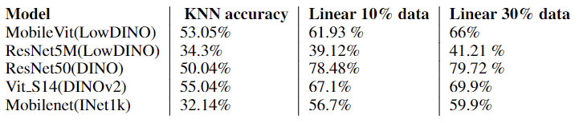

# LowDINO A low parameter self supervised learning model

LowDINO scripts are present in the custom folder.



<br>
We have trained the MobileVit and ResNet5M models in self supervised fashino using self distillation and compared the performances with the state of the art DINOv2.

MobileVit(LowDINO) with 5.5M parameters performs very close to the DINOv2 with 21.5M parameters over KNN evaluation. A similar trend can be observed after fine tuning the models over 10% and 30% of CIFAR 10 datasets, the MobileVit(LowDINO) with 4 times less parameter count performs very close to the State of the Art DINOv2 in classification tasks.

Though these results show promising, more researches have to be done to compare how the model performs in other tasks like image segmentation, etc.

To get started with the training the LowDINO model 


As a first step download the requirements and setup the working environment 

Environment setup: \
We have used CUDA 11.6 and Pytorch GPU to train all the models where are mentioned in this repository.
<br>

Pleaes refer to the following link to setup Pytorch CUDA locally \
https://pytorch.org/get-started/locally/ \
https://docs.nvidia.com/cuda/cuda-installation-guide-microsoft-windows/index.html
<br>
<br>


```
pip install -r requirements.txt
```

Move to custom folder

```
cd custom
```

There are two different scripts to make your tranining faster 

one use pytorch DataParallel and Colossalai's Distributed Dataparallel
To train the model of ResNet5M/MobileViT model using colossalai's Distributed Dataparallel

follow this command:

```
colossalai run --nproc_per_node 2 train_colossalai.py
```
The number 2 represents two GPUs on the system.


To train using Pytorch Dataparallel use make sure to include device ids based on the number of GPUs
available

```
python train_dp.py --device-ids [0,1]
```

pretrained==True applies to MobileViT model, one can Modify the mobilenet.py to change the models to 
Following are the models it supported backbones(Format shown is backbone: dim from the backbone)
<br>
'mobilevit_s':640  <br>
'mobilevit_xs':640  <br>
'mobilevit_xxs':640 <br>
'mobilenetv2_035':640 <br>
'mobilenetv2_075':640 <br>
'mobilenetv2_100':640 <br>
'resnet5m':512 <br>

Other Hyperparameters that can be tuned and passed

-b or --batch-size: an integer indicating the batch size (default: 1024) <br>
-l or --logging-freq: an integer indicating the frequency of logging (default: 1)<br>
--momentum-teacher: a float indicating the momentum of the teacher model (default: 0.9995) <br>
-c or --n-crops: an integer indicating the number of crops to be used for data augmentation (default: 4)<br>
-e or --n-epochs: an integer indicating the number of training epochs (default: 50)<br>
-o or --out-dim: an integer indicating the dimension of the output layer (default: 1024)<br>
-t or --tensorboard-dir: a string indicating the directory to save TensorBoard logs (default: "logs")<br>
--clip-grad: a float indicating the maximum value of the gradient norm for clipping (default: 2.0)<br>
--norm-last-layer: a flag indicating whether to normalize the output of the last layer (default: False)<br>
--batch-size-eval: an integer indicating the batch size for evaluation (default: 8)<br>
--teacher-temp: a float indicating the temperature of the teacher model for distillation (default: 0.04)<br>
--student-temp: a float indicating the temperature of the student model for distillation (default: 0.1)<br>
-d or --device-ids: a list of integers indicating the device IDs(GPUs) to use for training (default: [0,1])<br>
--pretrained: a flag indicating whether to use a pretrained model for training (default: False)<br>
--weight-decay: a float indicating the weight decay for regularization (default: 0.4)<br>


### Experiments for Distillation and BYOL replication are present in notebooks_distillation Folder
for MobileVits Distillation with ViT_s model use ***Distillation MobileVits.ipynb*** notebook
for ResNet5M Distillation with ResNet50 model use ***distillation_trainings_resnet.ipynb***
For running KNN on ResNet50 using BYOL follow ***BYOL.ipynb***


